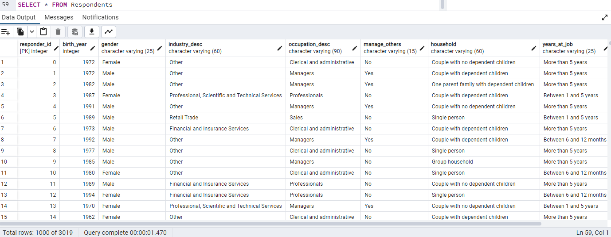

# RemoteWorkAnalysis

## Project Overview:

Following the peak of the COVID-19 pandemic, organizations across various industries have adopted widely varying permanent remote work policies for their employees. In this project, we analyzed data collected from remote employees across various industries in Australia in a 2-year study taking place during the height of the COVID-19 pandemic.

With our analysis, we aim to provide helpful insights for organizations seeking to enact remote work policies that maximize productivity and align with permanent demand for virtual and hybrid environments following the peak of the global pandemic. Our analysis is designed to help organizational stakeholders identify which factors play the largest role in worker productivity so they can make informed decisions around who should be considered for remote work and how much flexibility for remote work employees should receive.

## Preliminary Research into Work Trends of the past 3 years:
In our initial investigation of the topic, we found an abundance of research from Human Resources and Industrial Organizational Pychology experts focusing on the benefits of remote work for employees during and after the COVID-19 pandemic. Two factors we continuously noticed in the ongoing conversation were 1) the comparison between time saved commuting and time spent working for employees adjusting to remote work arrangements and 2) how family dynamic plays a part in the schedule of a remote employee. We decided to use these questions to guide our data analysis when constructing our key research questions around productivity and policy making.

## Guiding Questions for Our Analysis:
### Productivity:
  * What factors are most tied to worker productivity in remote environments?
  * Do workers that strongly prefer remote arrangements tend to be more productive? 
  * Do more productive employees tend to be more satisfied in their jobs?

### Analysis of Time Spent:
  * Commuting: What do employees do with the time they save commuting? What factors influence how saved time is used?
  * Do employees who save time commuting use saved time working? How much?
  
### Organizational Policy Practices:  
  * What percentage of remote work yields the highest rate of productivity? 
  * What position types are most productive when remotely working?
  

## Data:

### About the Data
The dataset used for this analysis was accessed via Kaggle’s dataset library, which contained a post of the dataset sourced from Maven Analytics. This data was collected by the New South Wales (NSW) Productivity Commission, a government task force in Australia tasked with identifying opportunities to boost productivity, through a series of “Remote Working Insight” surveys in 2020 and 2021. Each of the two surveys were completed through interviews with 1,500 employed workers in the New South Wales area who were identified as “remoteable” (defined as “having experience of remote working in their current job”) across a variety of industries and occupations. 
We selected this dataset because it provided insights into a wide range of variables related to remote work - including employee attitudes and preferences, organizational characteristics and policies, and breakdown of time allocated to tasks - as well as standard productivity measures. As described in the NSW summary, the survey questions asked participants about the following topics:
* Their attitudes to remote working 
* The amount of time they spent working remotely 
* Their employers’ policies, practices, and attitudes
* How they spent their time when working remotely
* How barriers to remote working have changed 
* The barriers they faced to hybrid working
* Their expectations for the future remote working 
*Source: 2021 Remote Working Survey Appendix A

### Initial Exploration

Initial exploration of the 2020 and 2021 datasets was conducted in Jupyter Notebook and Excel. During this step, we looked at features of the dataset, the values of unique responses, descriptive statistics of specific variables of interest, and patterns among population groups. As we began to examine both datasets prior to analysis, we noted a few patterns in the features of the data:

* Many survey questions changed from year to year as the commission identified the need for new or refined data. The 2021 survey incorporated over thirty additional questions. Survey questions were worded slightly differently and contained inconsistent punctuation.
* Nearly all data types are strings - Most of the survey questions prompted participants to select from a menu of categorical responses. As a result, the vast majority of columns contain object values.
* There are several outliers in responses where participants estimated the number of hours in a day spent on various activities. The range of estimated hours spent on tasks like commuting, caring and domestic responsibilities, and working sometimes exceeded more than 24 hours in a day. 
* Surveys were distributed to a diverse sample to ensure that demographics were representative of the workforce. The data has an even split of gender, age, and managers vs non-managers. Respondents are slightly skewed towards metro locations, organizations with more than 200 employees, and employees who have worked in their current organization for more than 5 years. While the most common industry types included the somewhat typically-remote fields of “Professional, scientific, and technical” and “Financial services”, the survey design intentionally sampled more from a wider range of 19 industries in an effort to be more representative of the total workforce. The datasets did not include information about race or salary.
* There is inherent bias in the sample towards those who work remotely (and who prefer to work remotely) - Plotting the response frequency for questions around the proportion of time working remotely shows that our dataset is skewed towards respondents who complete most of their work remotely or have a strong preference for working remotely. This is not surprising, given the survey was only distributed to workers whose jobs could be completed remotely.

Based on these initial observations in the dataset, we noted our cleaning needs and developed plans to prepare the data for our model and analysis.

### Preparing the Data for Analysis
* Merging of the data sets 
Our first step in preparing the data for analysis was merging the datasets collected during 2020 and 2021 into one file with similar columns. The biggest challenge associated with this task revolved around column names: while both dataframes asked similar questions, edits were made to the phrasing of most questions, which resulted in most columns having different names. 

To begin the process, we thoroughly examined both datasets and identified the columns that were conveying the same information. Secondly, we created a column key that helped us keep track of the original question language how they related to the newly created column labels. Finally, we used the column key to identify a final list of 30 shared columns that would be useful in our analysis, which were later merged into one dataset for cleaning. We used a python notebook ot merge the desired columns from both datasets into a merged dataframe with the code below. 

The shapes of our various datframes:
- The 2020 dataframe had 1507 rows and 109 columns.
- The 2021 dataframe had 1512 and 73 columns.
- Our merged dataset has 3019 rows and 30 columns before cleaning. 

### Cleaning the Data 

In order to prepare the merged dataset for modeling, we took the following steps to clean and transform the data:
*   **Transforming column headers** - Because spaces, question marks, and colons can make running code more challenging, these common punctuation marks were removed or replaced with underscores. To provide a unique reference id for each survey response, a column indicating a “responder_id” was added in place of the response ids, which repeated for each of the two datasets.
*   **Resolving null values** - We used a loop to print the number of null values for each column. Because the dataset is small, each row contains valuable information, and survey results should only be excluded from the dataset if absolutely necessary. Null values within categorical response columns were replaced with another string option - “No response” - in order to analyze potential patterns in skipped responses when modeling. If the null values occurred within a column with a numerical data type, the null values were replaced with the column’s median to reduce the impact of potential outliers on the model. 
*   **Identifying and replacing outliers** - Although most of the data types in this survey were object or string responses, several questions asked the respondents to estimate the number of hours in a day they spent on a variety of activities when working remotely compared to working in the office. Because the question was open-ended, participants could list any number, leading to a risk of outliers. When examining the data with boxplot visualizations and print statements of the maximum values, it became clear that several respondents interpreted the question as the number of hours per week instead of the number of hours per day, resulting in some values that exceeded 24 hours. Since someone cannot spend 40 hours per day working, these outliers needed to be addressed to improve the accuracy of the model. We adjusted the outliers by using a loop to: 1.)  identify responses exceeding three standard deviations from the mean and 2.) replace these values with the median of the column. 
*   **Bucketing categorical variables** - In order to prepare the data for a machine-learning model, all categorical variable types needed to be encoded into numeric values representing the response. If the column offers a large number of unique responses, the number of encoded variables becomes more complex. To make our model easier to analyze, we chose to “bucket” responses for categorical variables into broader categories in order to improve the efficiency of the model and reduce the impact of rare occurrences. For example, we examined the distribution of industry and occupation descriptors (which had 26 and 50 unique values, respectively) and recategorized those occurring with the lowest frequency as “other.” Additionally, many questions asked respondents to select from a menu of options the proportion of time they work remotely or would prefer to work remotely. Options included both percentages and text (ex: “20%”, “50%-About half of my time”), as well as similar values (“Rarely,” “Less than 10% of my time”), making the responses more difficult to interpret. In order to simplify these categories, we chose to reframe the options in the context of the number of days in the workweek, as outlined in the survey questions (“If you work a 5 day week, 1 day equals 20% of your work time.”). By recategorizing the response options from percentages and text to five categories representing the number of weekdays (0-1 days, 1-2 days, 2-3 days, 3-4 days, 4-5 days), we made our variables easier to analyze and interpret.   
*   **Adding engineered features of interest for our analysis** - To make our analysis more robust, we then explored opportunities to generate calculated fields from existing columns that may provide insight into our research questions. Since we are interested in exploring how time being saved from commuting may be redistributed among remote workers (either towards working more productively or towards other areas of work-life balance), we generated a new field called “commute_time_difference” by subtracting the remote commute time from the in-person commute time. Additional calculated fields may be created as the analysis progresses.   

### Assembling the Database 
**Organizing the Data into Tables**
* Once the data was cleaned, the dataset was then broken down into three groups. A Respondents table was created using columns of data that asked questions about the participants personal attributes such as birth year, gender, years at job and occupation description. 
* The second table, Organizational Data, was created by using columns of survey questions that asked the participants about the organization that they worked for. These questions addressed the size of the organization that they worked for, whether the organization encouraged remote work, or if the employer would support remote work if the pandemic was over. 
* Thirdly, a Time Management table was created using columns of survey questions that asked the respondents about how they spent their time while remote working. This included questions like what percent of time they spent remote working in 2020, and their productivity at home versus at the office.   Other columns of this table asked about time spent commuting, hours spent working, and hours of personal family time for both remote and in-person work.

**Creating the Database**
* After the data was grouped into these three tables the following Entity Relationship Diagram (ERD) was created to map out the database. Note that a responder_id column was added to each of the tables as a primary and foreign key to create relationships between the SQL tables.

* A jupyter notebook was then used to create dataframes for each of these tables, and then exported these dataframes into their own csv files. 
* Using pgAdmin 4, PostgreSQL schemas were developed to create the database. The following SQL tables were created. 

#### Respondents

#### Organizational Data

#### Time Management

### Assembling Machine Learning Model (Sean)

### Creating Visualization and Presentation (TBD)

### Things we're hoping to find... (Nik)

